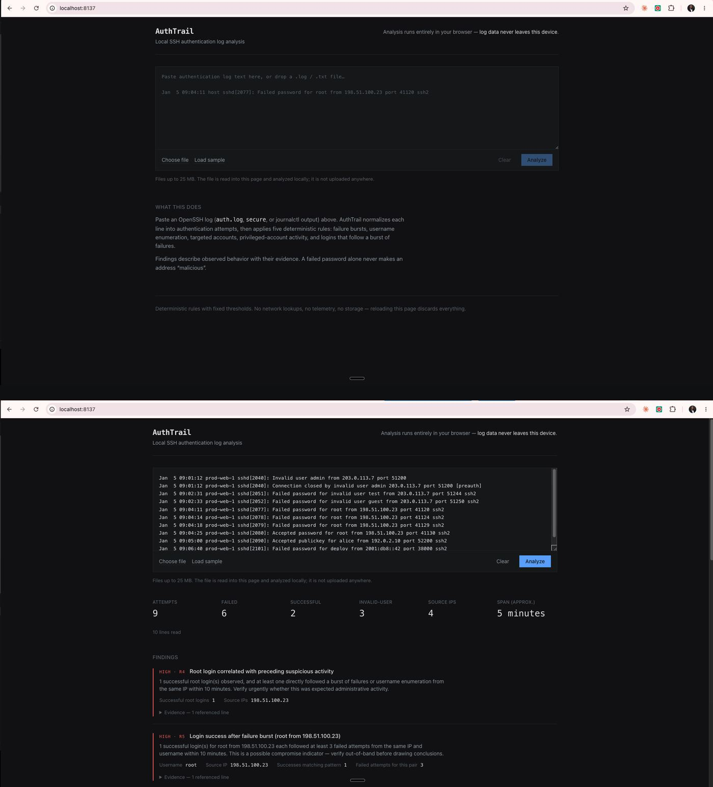

# AuthTrail

Local-first OpenSSH authentication log analysis with deterministic detections and evidence-backed findings. AuthTrail runs entirely in the browser: uploaded logs are not sent to a server, persisted, enriched by third parties, or used for telemetry.



## Why AuthTrail

Authentication logs are easy to collect and tedious to investigate. AuthTrail turns raw OpenSSH activity into a compact analyst view while keeping the reasoning inspectable. Each finding is tied to the log evidence that caused it to fire, and ambiguous chronology or correlation fails conservatively instead of inventing certainty.

## Capabilities

- Paste authentication logs or upload `.log` / `.txt` files
- Parse common `sshd` and `sshd-session` authentication records
- Normalize IPv4, IPv6, and IPv4-mapped IPv6 source identities
- Separate confirmed authentication attempts from supporting observations
- Detect deterministic R1-R5 behaviors with causal evidence
- Surface failed and successful authentication activity, username enumeration, privileged-account activity, and success-after-failure sequences
- Filter and inspect normalized events and raw source lines
- Preserve original source line numbers for evidence references
- Suppress time-window rules when chronology cannot be established confidently
- Run locally as a static Next.js export with no backend

## Detection rules

AuthTrail describes observed behavior. It does not label an IP address as malicious merely because an authentication attempt failed.

| Rule | Condition | Severity |
| --- | --- | --- |
| R1 | At least 5 failed attempts from one IP within a 10-minute sliding window | Medium, high at 20+ |
| R2 | At least 3 distinct nonexistent usernames from one IP | Low, medium when concentrated within 10 minutes |
| R3 | Username receives at least 3 attempts | Informational |
| R4 | Privileged-account activity | Informational for failures, medium for root success, high only with qualifying correlated activity |
| R5 | Successful authentication after at least 3 failures from the same IP and username within 10 minutes | High |

Time-dependent tiers require confident relative chronology. If a file mixes timestamp forms whose elapsed relationship cannot be established safely, those tiers stay silent and AuthTrail tells the user why.

## Privacy model

- Parsing, chronology, correlation, detection, and statistics execute in the browser.
- No telemetry, analytics, external APIs, IP reputation lookups, accounts, or database.
- Nothing is persisted. Reloading the page discards the input and analysis.
- Production output is a static export (`next build` to `out/`).
- Log contents are rendered as escaped React text. `dangerouslySetInnerHTML` is not used.

## Correctness policies

**Attempts vs. observations.** Self-contained `Failed` and `Accepted` credential-result records create authentication attempts. Supporting OpenSSH records remain observations unless they can be correlated confidently. Uncertain observations stay visible but do not inflate thresholds or statistics.

**Duplicates.** Identical repeated lines cannot reliably be distinguished from duplicate artifacts, so only the first occurrence participates in behavioral counts. Repeated lines remain visible and disclosed.

**Timestamps.** Traditional syslog timestamps contain no year. AuthTrail never invents an absolute calendar year. It derives relative time only where the sequence is defensible and suppresses windowed detections when chronology becomes unreliable.

**Provenance.** Every retained nonblank line preserves its original source line number. Unrecognized lines remain inspectable rather than disappearing silently.

## Supported input

- `.log` and `.txt` files up to 25 MB
- Pasted input up to 5 MB
- Traditional syslog timestamps, including fractional seconds
- ISO 8601 / journalctl-style timestamps
- IPv4 and IPv6 sources, including canonicalized IPv4-mapped IPv6
- `Failed` / `Accepted` methods including password, publickey, keyboard-interactive/pam, and none
- `Invalid user`, disconnect, connection-close, and selected PAM observation records
- `sshd` and `sshd-session`

Other SSH messages remain available as context observations instead of being promoted into unsupported authentication semantics.

## Architecture

```text
input
  -> ingest
  -> parse
  -> chronology
  -> correlate
  -> detect + stats
  -> render
```

The analysis core under `src/lib/` is pure TypeScript and independently testable. React is kept in the presentation layer under `src/components/`.

See [docs/architecture.md](docs/architecture.md) for the detailed boundaries and security model.

## Development

Requires Node.js 24+.

```sh
npm install
npm run dev
```

Open `http://localhost:3000`.

Verification:

```sh
npm test
npm run lint
npm run build
npm run bench
```

The current suite includes parser, chronology, correlation, detection, UI, accessibility, privacy-oriented rendering, and adversarial performance regression coverage.

## Production build

```sh
npm run build
python3 -m http.server 4173 -d out
```

Open `http://localhost:4173`.

## Roadmap

The next phases focus on investigation quality before broadening telemetry coverage:

1. Rule explanations, exportable reports, and session reconstruction
2. sudo activity, fail2ban correlation, and richer journalctl support
3. Timeline and log-to-log comparison
4. Multi-source local investigation workspace and Windows authentication events

See [ROADMAP.md](ROADMAP.md) for the full plan.

## Benchmark provenance

The repository includes the tag `k3-authtrail-benchmark-v1`, marking the reviewed v1 state produced during a Kimi K3 engineering benchmark. The product itself is model-agnostic and does not depend on an AI service at runtime.
